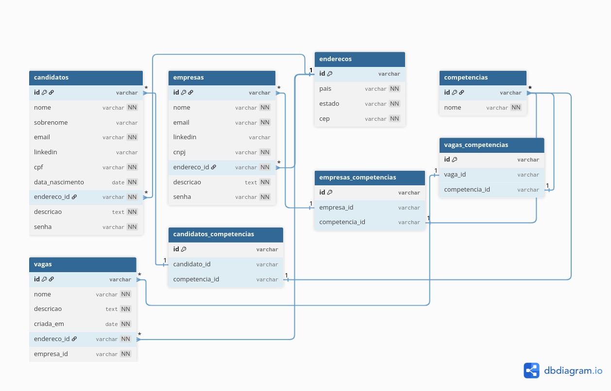

# Linketinder Project

Este repositório será utilizado para o desenvolvimento do Linketinder Project durante o Acelera ZG.

## 📌 Funcionalidades
1. Listar todas as empresas
2. Cadastrar nova empresa
3. Listar todos os candidatos
4. Cadastrar novo candidato


## 🛠️ Tecnologias utilizadas
- Backend:
    - Groovy

- Frontend:
    - Typescript
    - HTML
    - Css

- Banco de dados:
    - PostgreSQL


## 📂 Estrutura do projeto

- **Backend**: `Linkertinder/src/main/groovy/org/acelerazg/Main.groovy` → Classe principal para executar a aplicação.
- **Frontend**:  `Linkertinder/frontend`

## Modelo lógico de Banco de Dados
Para elaborar esse modelo foi utilizada a ferramenta: https://dbdiagram.io/home



- O Script SQL se encontra na pasta: `Linkertinder/src/main/groovy/resources`

## 🚀 Como executar

- Clone este repositório 

``` 
git clone  git@github.com:mclara831/Linketinder-Project.git
```

-  Abra na sua IDE de preferência

- Backend:
    - Navegue atá a classe principal indicada no caminho acima:

    ``` 
    cd Linkertinder
    ```
    - Execute o projeto

    ```
    java -jar build/libs/Linkertinder-all.jar

    ```

- Frontend: 
    - Navegue atá a classe principal indicada no caminho acima:

    ``` 
    cd Linkertinder/frontend
    ```
    - Instale as dependências:

    ``` 
    npm install
    ```
    - Execute a aplicação:
    ```
    npm run dev
    ```


## 👩‍💻 Créditos

- Maria Clara Barbosa Fernandes