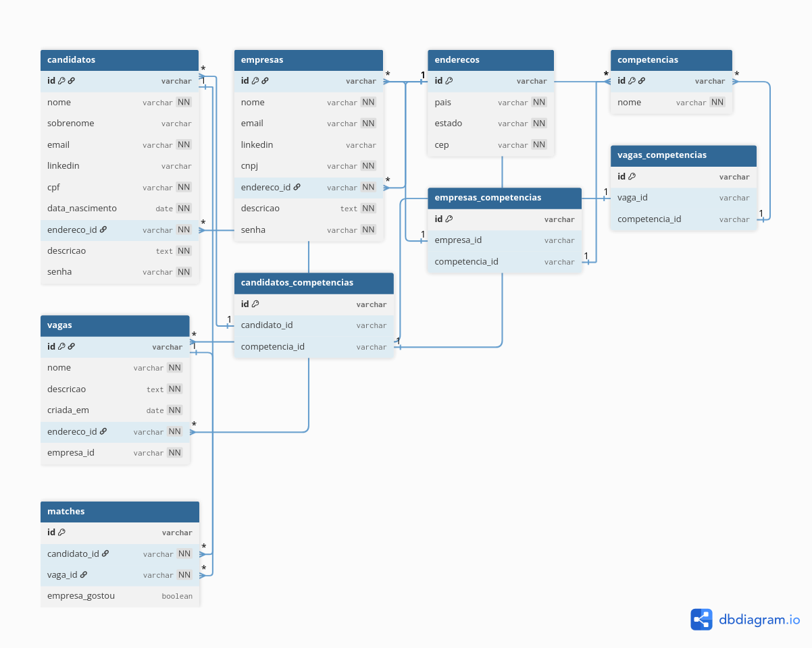

# Linketinder Project

Este repositório será utilizado para o desenvolvimento do Linketinder Project durante o Acelera ZG.

## 🧠 Descrição do Projeto

O Linketinder é uma plataforma de recrutamento que une as funcionalidades do LinkedIn à mecânica de correspondência do Tinder.
A aplicação permite que empresas e candidatos interajam de forma anônima, revelando suas informações completas apenas quando ocorre um match, incentivando uma seleção baseada em competências e interesses compatíveis.

### Índice de Afinidade

Para implementar a funcionalidade de cálculo de afinidade, tanto para o candidato quanto para a empresa, as informações de cada usuário são armazenadas no localStorage no momento do login.

Ao renderizar os candidatos para a empresa, esses dados são recuperados e o índice de afinidade é calculado com base nas competências (skills) da empresa. O mesmo processo ocorre na exibição das vagas para o candidato, porém, nesse caso, o cálculo é feito considerando as skills da empresa responsável pela vaga.

Esse mecanismo permite identificar e exibir o grau de compatibilidade entre candidatos e vagas de forma dinâmica e personalizada.

### 🔍 Lógica de Match

A lógica de match foi desenvolvida para garantir um processo justo e anônimo entre candidatos e empresas. O fluxo funciona da seguinte forma:

- **Início da interação**: o candidato é quem dá o primeiro passo, curtindo uma vaga disponível no sistema. Nesse momento, ele não sabe qual é a empresa responsável pela vaga, pois suas informações permanecem ocultas.
    
    Quando essa curtida ocorre, é registrado no banco de dados um novo interesse de match, onde o campo `empresa_gostou` é definido com o valor padrão `false`, indicando que a empresa ainda não demonstrou interesse.

- **Visão da empresa**: ao acessar suas vagas, a empresa pode visualizar todos os candidatos que demonstraram interesse. As informações dos candidatos são exibidas de forma anônima, garantindo a confidencialidade até que o interesse seja recíproco.

- **Formação do match**: quando a empresa também curte o candidato, o match é consolidado. Nesse momento:

    -  As informações de ambas as partes são reveladas, permitindo o contato direto e a continuidade do processo seletivo;

    - No banco de dados, o campo `empresa_gostou` é atualizado para `true`, representando o match confirmado.

Esse modelo garante que:
- O processo de match só acontece quando há interesse mútuo entre as partes;

- As empresas não curtem candidatos aleatoriamente, mas apenas aqueles que demonstraram interesse em uma vaga específica.

## 📌 Funcionalidades
    ===> Empresas
    1. Listar todas empresas
    2. Cadastrar nova empresa
    3. Atualizar dados de empresa
    4. Deletar empresa

    ===> Candidatos
    5. Listar todos candidatos
    6. Cadastrar novo candidato
    7. Atualizar dados de candidato
    8. Deletar candidato

    ===> Vagas
    9. Listar todas vagas
    10. Encontrar vagas por CNPJ
    11. Cadastrar nova vaga
    12. Atualizar dados de vaga
    13. Deletar vaga

    ===> Competencias
    14. Listar todas competências
    15. Cadastrar nova competência
    16. Cadastrar uma lista de competência
    17. Atualizar dados de competência
    18. Deletar competência


## 🛠️ Tecnologias utilizadas
- Backend:
    - Groovy

- Frontend:
    - Typescript
    - HTML
    - Css

- Banco de dados:
    - PostgreSQL


## 📂 Estrutura do projeto

- **Backend**: `backend/src/main/groovy/org/acelerazg/Main.groovy` → Classe principal para executar a aplicação.
- **Frontend**:  `frontend` → contém os arquivos para execução do frontend da aplicação.

## Modelo lógico de Banco de Dados
Para elaborar esse modelo foi utilizada a ferramenta: https://dbdiagram.io/home



- O Script SQL se encontra na pasta: `backend/src/main/groovy/resources`

## 🔧 Refatoração do Projeto

Durante o processo de refatoração, o projeto passou por uma série de melhorias estruturais, semânticas e de boas práticas, tanto no frontend quanto no backend, com o objetivo de tornar o código mais organizado, escalável e aderente aos princípios de arquitetura limpa e manutenibilidade.

### 🖥️ Frontend

- **Tradução completa para inglês**: todas variáveis e arquivos foram padronizados para o inglês, garantindo consistência com o backend e maior compatibilidade com padrões internacionais.

- **Separação da manipulação do DOM da camada de serviço**: agora a lógica de interação com a interface está desacoplada da lógica de negócio, seguindo uma arquitetura mais modular e de fácil manutenção.

**Aplicação dos Princípios SOLID**

- Foi implementada uma interface para o provedor de gráficos, permitindo a substituição ou extensão do mecanismo de renderização sem alterar o código principal (OCP e DIP).

- O antigo FormService foi refatorado em três módulos independentes — FormReader, FormValidator e FormCleaner — garantindo coesão e aplicando o SRP.

- A função de cálculo das competências dos candidatos foi extraída do CandidateService e movida para um novo módulo CandidateMetrics, favorecendo a extensibilidade e a organização modular.

**Aplicação dos Padrões de Projeto**

- Observer: Implementado para sincronizar e atualizar dinamicamente os componentes da interface sempre que há alterações nos dados (como criação, edição ou exclusão de vagas).

### ⚙️ Backend

- **Tradução completa para inglês**: todas as classes, métodos, variáveis e mensagens de log foram traduzidas para o inglês, mantendo consistência com o frontend e boas práticas de desenvolvimento.

- **Implementação de testes unitários**: adicionados testes para os principais serviços, garantindo maior confiabilidade e facilitando futuras alterações no código.

- **Separação da camada de UI (entrada e saída de dados)**: a leitura de dados e a exibição de mensagens de tela foram isoladas da lógica de negócio, deixando as classes de serviço e domínio mais limpas.

- **Criação de uma classe genérica para repositório**: foi criada uma classe base para centralizar a execução de operações genéricas (como INSERT, UPDATE e DELETE), reduzindo duplicação de código em entidades como Candidate, Company e Job.

- **Implementação de tratamento de exceções**: agora os erros são tratados de forma mais elegante e informativa, com logs descritivos e mensagens controladas para o usuário.

- **Melhoria no uso de conexões com o banco de dados**: as conexões são corretamente abertas e fechadas em blocos try-finally, evitando vazamento de recursos.

**Aplicação dos Princípios SOLID**

- Todas as classes de controller, service e repository utilizam injeção de dependência, promovendo baixo acoplamento e facilitando testes unitários.

- Cada camada de service possui uma interface de apoio, garantindo a aplicação do Princípio da Inversão de Dependência (DIP) e facilitando futuras extensões.

- A lógica de competências foi separada em serviços especializados — CandidateSkillService, CompanySkillService e JobSkillService — atendendo ao Princípio da Responsabilidade Única (SRP) e ao Princípio Aberto/Fechado (OCP).

- Foram criados DTOs de resposta específicos para a listagem completa das entidades, assegurando segregação de responsabilidades e melhor controle sobre os dados expostos.

**Aplicação dos Padrões de Projeto** 

- Singleton: Utilizado para garantir uma única instância da conexão com o banco de dados durante toda a execução da aplicação, garantindo controle centralizado do acesso ao banco.

- Abstract Factory: Aplicado para criar objetos de repositórios de forma desacoplada. Com isso, é possível trocar ou estender dependências (como o tipo de banco de dados) sem modificar o restante do código.

## 🚀 Como executar

- Clone este repositório 

``` 
git clone  git@github.com:mclara831/Linketinder-Project.git
```

-  Abra na sua IDE de preferência

### Backend:

1. Para conectar a aplicação ao banco de dados, foi utilizado um container PostgreSQL executado no Docker, responsável por armazenar e povoar as tabelas do sistema.

    ```docker
    docker run --name linketinderdb \
    -e POSTGRES_USER=postgres \
    -e POSTGRES_PASSWORD=postgres \
    -e POSTGRES_DB=linketinderdb \
    -p 5435:5432 \
    -d postgres:16.3
    ```
2.  Navegue atá a classe principal indicada no caminho acima:

    ```bash
    cd backend
    ```

3.  Faça o build do projeto

    ```bash
    gradle build
    ```

3. Execute o projeto

    ```bash
    gradle run
    ```
    ou

    ```bash
    java -jar build/libs/backend-all.jar
    ```

### Frontend: 
1. Navegue atá a classe principal indicada no caminho acima:

    ```bash 
    cd frontend
    ```
2. Instale as dependências:

    ```bash
    npm install
    ```
3. Execute a aplicação:
    ```bash
    npm run dev
    ```


## 👩‍💻 Créditos

- Maria Clara Barbosa Fernandes