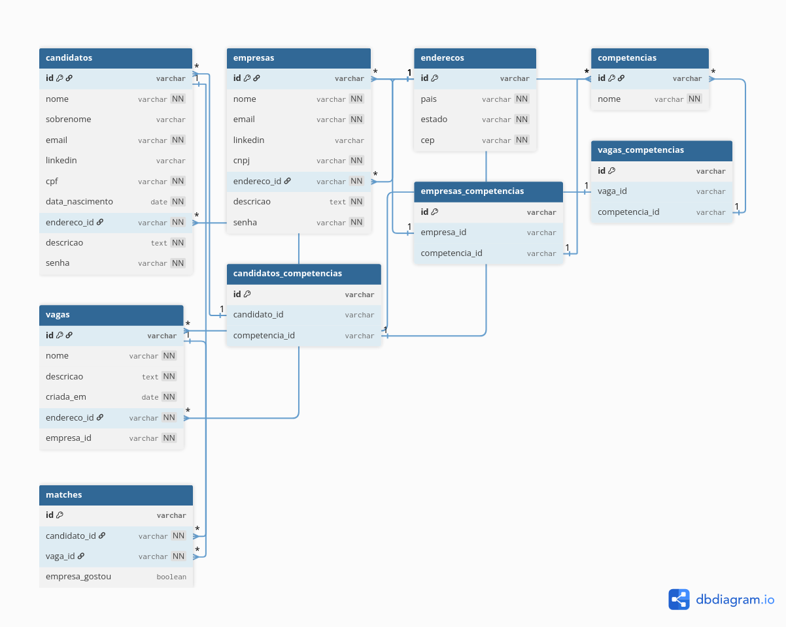

# Linketinder Project

Este repositório será utilizado para o desenvolvimento do Linketinder Project durante o Acelera ZG.

## 🧠 Descrição do Projeto

O Linketinder é uma plataforma de recrutamento que une as funcionalidades do LinkedIn à mecânica de correspondência do Tinder.
A aplicação permite que empresas e candidatos interajam de forma anônima, revelando suas informações completas apenas quando ocorre um match, incentivando uma seleção baseada em competências e interesses compatíveis.

### 🔍 Lógica de Match

A lógica de match foi desenvolvida para garantir um processo justo e anônimo entre candidatos e empresas. O fluxo funciona da seguinte forma:

- **Início da interação**: o candidato é quem dá o primeiro passo, curtindo uma vaga disponível no sistema. Nesse momento, ele não sabe qual é a empresa responsável pela vaga, pois suas informações permanecem ocultas.
    
    Quando essa curtida ocorre, é registrado no banco de dados um novo interesse de match, onde o campo `empresa_gostou` é definido com o valor padrão `false`, indicando que a empresa ainda não demonstrou interesse.

- **Visão da empresa**: ao acessar suas vagas, a empresa pode visualizar todos os candidatos que demonstraram interesse. As informações dos candidatos são exibidas de forma anônima, garantindo a confidencialidade até que o interesse seja recíproco.

- **Formação do match**: quando a empresa também curte o candidato, o match é consolidado. Nesse momento:

    -  As informações de ambas as partes são reveladas, permitindo o contato direto e a continuidade do processo seletivo;

    - No banco de dados, o campo `empresa_gostou` é atualizado para `true`, representando o match confirmado.

Esse modelo garante que:
- O processo de match só acontece quando há interesse mútuo entre as partes;

- As empresas não curtem candidatos aleatoriamente, mas apenas aqueles que demonstraram interesse em uma vaga específica.

## 📌 Funcionalidades
    ===> Empresas
    1. Listar todas empresas
    2. Cadastrar nova empresa
    3. Atualizar dados de empresa
    4. Deletar empresa

    ===> Candidatos
    5. Listar todos candidatos
    6. Cadastrar novo candidato
    7. Atualizar dados de candidato
    8. Deletar candidato

    ===> Vagas
    9. Listar todas vagas
    10. Encontrar vagas por CNPJ
    11. Cadastrar nova vaga
    12. Atualizar dados de vaga
    13. Deletar vaga
    
    ===> Competencias
    14. Listar todas competências
    15. Cadastrar nova competência
    16. Cadastrar uma lista de competência
    17. Atualizar dados de competência
    18. Deletar competência


## 🛠️ Tecnologias utilizadas
- Backend:
    - Groovy

- Frontend:
    - Typescript
    - HTML
    - Css

- Banco de dados:
    - PostgreSQL


## 📂 Estrutura do projeto

- **Backend**: `backend/src/main/groovy/org/acelerazg/Main.groovy` → Classe principal para executar a aplicação.
- **Frontend**:  `frontend` → contém os arquivos para execução do frontend da aplicação.

## Modelo lógico de Banco de Dados
Para elaborar esse modelo foi utilizada a ferramenta: https://dbdiagram.io/home



- O Script SQL se encontra na pasta: `backend/src/main/groovy/resources`

## 🚀 Como executar

- Clone este repositório 

``` 
git clone  git@github.com:mclara831/Linketinder-Project.git
```

-  Abra na sua IDE de preferência

### Backend:

1. Para conectar a aplicação ao banco de dados, foi utilizado um container PostgreSQL executado no Docker, responsável por armazenar e povoar as tabelas do sistema.

    ```docker
    docker run --name linketinderdb \
    -e POSTGRES_USER=postgres \
    -e POSTGRES_PASSWORD=postgres \
    -e POSTGRES_DB=linketinderdb \
    -p 5435:5432 \
    -d postgres:16.3
    ```
2.  Navegue atá a classe principal indicada no caminho acima:

    ```bash
    cd backend
    ```
3. Execute o projeto

    ```bash
    java -jar build/libs/backend-all.jar
    ```

### Frontend: 
1. Navegue atá a classe principal indicada no caminho acima:

    ```bash 
    cd frontend
    ```
2. Instale as dependências:

    ```bash
    npm install
    ```
3. Execute a aplicação:
    ```bash
    npm run dev
    ```


## 👩‍💻 Créditos

- Maria Clara Barbosa Fernandes